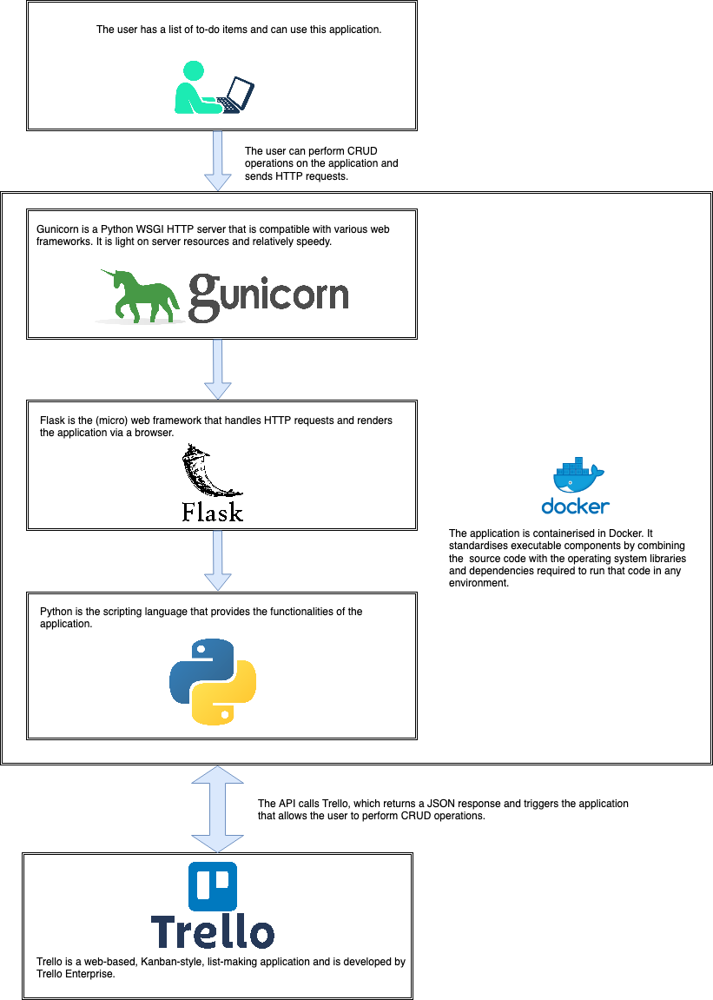
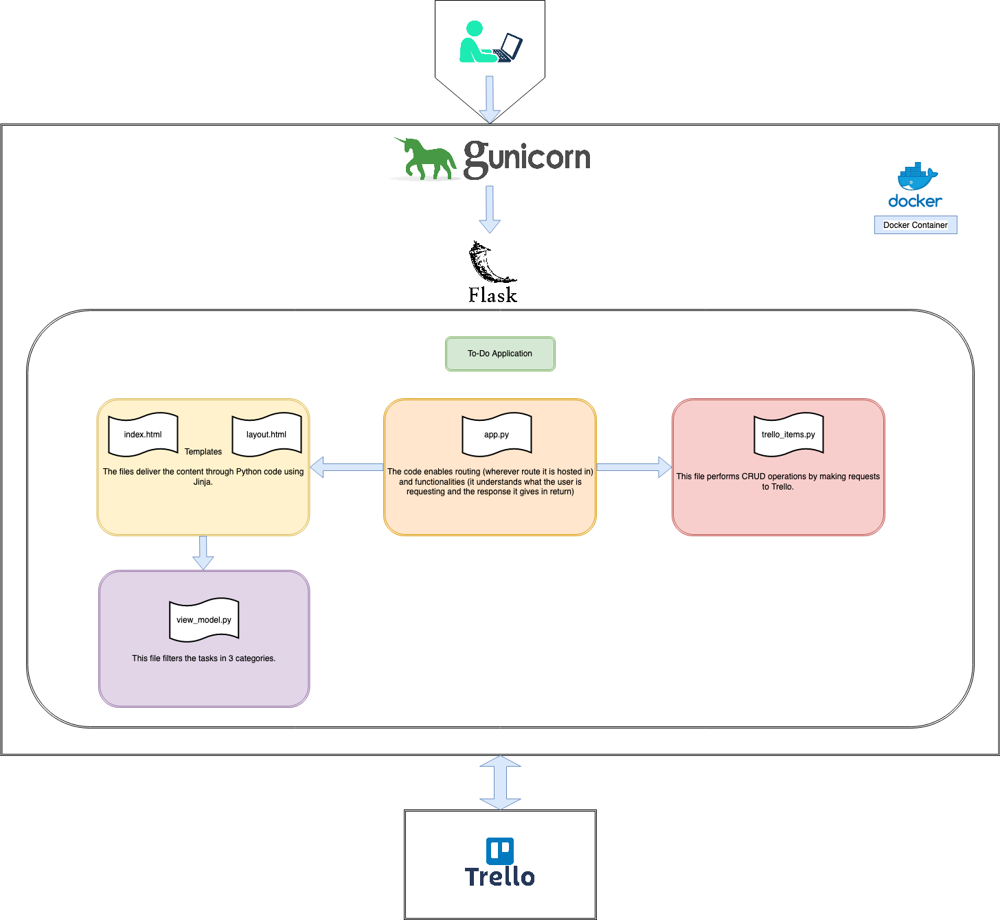

# DevOps Apprenticeship: Project Exercise

<p align="left">
  <a href="https://github.com/francescowang/DevOps-Course-Starter.git"></a>
</p>


## System Requirements

The project uses poetry for Python to create an isolated environment and manage package dependencies. To prepare your system, ensure you have an official distribution of Python version 3.9+ and install Poetry using one of the following commands (as instructed by the [poetry documentation](https://python-poetry.org/docs/#system-requirements)):

### Poetry installation (Bash)

```bash
curl -sSL https://raw.githubusercontent.com/python-poetry/poetry/master/get-poetry.py | python -
```

### Poetry installation (PowerShell)

```powershell
(Invoke-WebRequest -Uri https://raw.githubusercontent.com/python-poetry/poetry/master/install-poetry.py -UseBasicParsing).Content | python -
```

## Dependencies

The project uses a virtual environment to isolate package dependencies. To create the virtual environment and install required packages, run the following from your preferred shell:

```bash
$ poetry install
```

You'll also need to clone a new `.env` file from the `.env.template` to store local configuration options. This is a one-time operation on first setup:

```bash
$ cp .env.template .env
```

The `.env` file is used by flask to set environment variables when running `flask run`. This enables things like development mode (which also enables features like hot reloading when you make a file change). There's also a [SECRET_KEY](https://flask.palletsprojects.com/en/1.1.x/config/#SECRET_KEY) variable which is used to encrypt the flask session cookie.

## Running the App

Once the all dependencies have been installed, start the Flask app in development mode within the Poetry environment by running:
```bash
$ poetry run flask run
```

You should see output similar to the following:
```bash
 * Serving Flask app "app" (lazy loading)
 * Environment: development
 * Debug mode: on
 * Running on http://127.0.0.1:5000/ (Press CTRL+C to quit)
 * Restarting with fsevents reloader
 * Debugger is active!
 * Debugger PIN: 226-556-590
```
Now visit [`http://localhost:5000/`](http://localhost:5000/) in your web browser to view the app.


In the .env file, add the trello API keys and IDs. Login to Trello and use Postman to get started. E.g.
```
SECRET_KEY=
TRELLO_KEY=
TRELLO_TOKEN=
BOARD_ID=
NOT_STARTED_ID=
DOING_ID=
COMPLETED_ID=
```

## Testing the App

Run the following command from the parent directory:

```poetry run pytest```

If you wish to run only selected tests:

```poetry run pytest todo_app/tests/<file that needs testing>```

Or cd into the directory:

```cd todo_app/tests```
```poetry run run pytest/<file that needs testing>```


## Ansible

If you want to use ansible to deploy the application, make sure ansible is installed on the control node. Install it according to your operating system. 

Note:
- controller-ip-address is the Control Node 
- host-ip-address is the Managed Node

```
ssh ec2-user@<controller-ip-address>
```

- Once logged in the Control Node, create an SSH key pair with this command
```
ssh-keygen
```
- Now enter the password one last time
```
ssh-copy-id ec2-user@<controller-ip-address>
```

- You are now logged in Control Node using SSH
- You can end an SSH session with the command ```exit```

Repeat the process for Managed Node by running the following commands and enter the password

- ```ssh ec2-user@<host-ip-address>```
- ```ssh-keygen```
- ```ssh-copy-id ec2-user@<host-ip-address>```

Go back to the project directory, you can now ssh into both nodes without the password
Get into Controlled Node, then Managed Node and see the authorised keys

```
cat ~/.ssh/authorized_keys
```

If you want to access the control node via Visual Studio Code, follow these steps: 

- Install this extension -> Remote - SSH 
- Command + shift N to open a new window
- Click on the purple rectable bottom left and click on connect host
- Enter the ec2-user@<controller-ip-address>
- Create/Edit an inventory.ini file and playbook.yml file
- Run the following commands for testing purposes:
  - `ansible -i inventory.ini`
  - `ansible franky-host -i inventory.ini -m ping`
- Run ```whoami``` to find out username of the current user when this command is invoked
  - `ansible-playbook playbook.yml -i inventory.ini`

## Running the app in Docker

If you want to run the application in Docker, you first need to build an image locally. 

```docker build --tag todoapp:dev . --target development```

Note: This command builds an image for development. It automatically adds colon and 'latest' if you just leave the name e.g. todoapp.

To run an image with the bind mount to allow hot realoding, use the following command:

```docker run --env-file .env -p 5001:5000 --volume $(pwd)/todo_app:/opt/todo_app todoapp:dev```

Note: port 5000 is taken by airplay

Having said this, if you want to run the application in production on Docker, you first need to build an image. 

```docker build --target prod --tag todoapp:prod .```

Running a container based on the todoapp:prod image

```docker run --env-file .env -it -p 5000:80 todoapp:prod```

Note: port 80 is the port that gunicorn uses

## Debugging Docker

If you have problems within the container, you can investigate what's going on in the container.

```docker run --entrypoint bash -it todoapp:dev```

This builds an image for testing.

```docker build --target test --tag test-image-v1 .```

This runs the image for testing.

```docker run test-image-v1```


<div align="center">
<h2 style=color:tomato><b>Architectural Diagram</b></h2>
</div>

<div align="center">
<h3 style=color:SkyBlue> <b>Context Diagram</b> </h3>

<p> <strong> Figure: </strong> Context Diagram </p>
</div>

<div align="center">
<h3 style=color:SkyBlue> <b>Container Diagram</b> </h3>

<p> <strong> Figure: </strong> Container Diagram </p>
</div>

<div align="center">
<h3 style=color:SkyBlue> <b>Component Diagram</b> </h3>

<p> <strong> Figure: </strong> Component Diagram </p>
</div>


## Accessing the live website

This website is automatically pushed on the main brach and deployed to Azure. It can be accessed via this link [FrankyToDo](https://frankytodo.azurewebsites.net).
